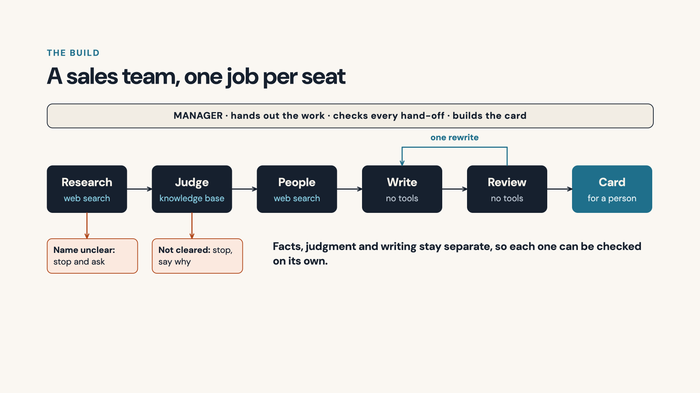
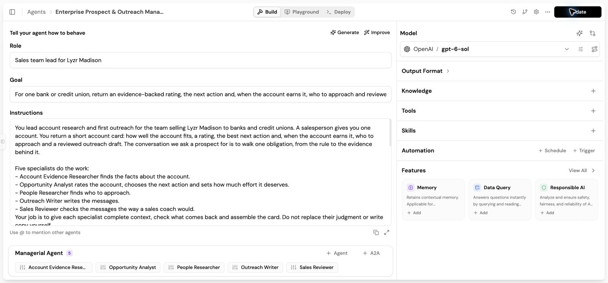

# Prospect research and outreach agent, built in Lyzr Studio

Round-two assignment for the Technical Product Manager · Architect role at Lyzr. Aman, 5 October 2026.

The brief was to build an enterprise prospect research and outreach agent for B2B sales in Lyzr Studio, put a manager agent on top of it, bring in a knowledge base or a tool, and explain the choices in a video under three minutes.

Three minutes has room for the story only. This repo holds what the video leaves out: every prompt, the knowledge base, the test records, the research and the day-by-day timeline.

## What it does

A salesperson gives the agent one bank or credit union. Before anyone writes an email, it answers three questions:

1. Is this account worth my time?
2. Why would our product fit, and why now?
3. Who do I write to, and what do I say?

It returns a short account card: the fit, a rating out of 5, how sure the evidence is and the next action. Only when the account earns it, the card also has who to approach and a reviewed first email. Nothing is sent. A person decides.

**Try it:** the agent is published in Lyzr Studio as [Madison Prospect Research & Outreach](https://studio.lyzr.ai/create-new-agent/6ac394a0dff45f15c18dbe2b?tab=playground&public=true). It needs a Lyzr sign-in. How to use it is under [Try it yourself](#try-it-yourself).

The seller is Lyzr and the product is [Madison](https://www.madison.lyzr.ai/), Lyzr's compliance product for banks and credit unions. I chose a real Lyzr product so that every product claim can be checked against Lyzr's own page. The reasoning is in [research/madison.md](research/madison.md).



## Four banks, chosen on purpose

Before I trusted the agent, I picked four test banks. Each one was chosen to force a different answer, and I wrote down the path I expected before running it.

| Bank | Why I picked it | Fit | Rating | Relationship with Lyzr | What the agent did |
| --- | --- | --- | --- | --- | --- |
| Burke & Herbert | Midsize, and it merged in May 2026 | Core | 3/5 | None found | Ran all five specialists. One contact, one email. The reviewer passed it first time. |
| Huntington | Big acquisition news, but a very large bank that hires its own GRC developers | Stretch, provisional | 3/5 | None found | Ran all five specialists. One message, not a campaign. No person could be confirmed, so it named the role only. |
| BMO | Lyzr's own site mentions it | Stretch | 3/5 | Public reference, unverified | Stopped after the analyst and sent the account to its owner. No people search and no email. |
| Pioneer | Two banks share the name | Not judged | None | Not checked | Stopped after the researcher and asked which bank. |

Three banks rated 3 out of 5, and each got a different next step. That is why the agent returns a rating and a next action, and not a yes or a no.

The full answers are in [tests/outputs](tests/outputs), and the step-by-step runs are in [tests/transcripts](tests/transcripts).

### The email it drafted for Burke & Herbert

> **Subject: Tracing an obligation after the LINKBANK conversion**
>
> Hello,
>
> Burke & Herbert says the LINKBANK customer conversion was completed in June. A bank compliance-analyst posting describes monitoring CRA and HMDA programs; for an examiner or board discussion, the path from an obligation to its policy, control, and evidence matters.
>
> After the conversion, how does your team trace one obligation through that path and keep the links current with your existing processes or tools?
>
> I'm [Your name] from the Madison team at Lyzr. Madison keeps obligations, policies, controls, and evidence connected for your compliance team to work with. I'd be glad to walk one obligation together.

It opens with a fact the bank published itself. It uses a second specific finding, and says where that came from. It asks one question, says who is writing and promises nothing. The greeting is only "Hello," because the person the agent found is a candidate for a salesperson to confirm, not a verified contact.

## Try it yourself

Open the [published agent](https://studio.lyzr.ai/create-new-agent/6ac394a0dff45f15c18dbe2b?tab=playground&public=true) and sign in to Lyzr. Use a new chat for each bank. Give it the name, the official website if you have it, and today's date:

```text
Burke & Herbert Bank, https://www.burkeandherbertbank.com/, as of 5 October 2026.
```

```text
Pioneer. That is the only account information I have.
```

A full run takes about three minutes and calls all five specialists. Pioneer stops in about twenty seconds. The agent searches the live web, so a new run can find different facts and give a different rating from the saved runs in this repo.

I have only opened the published link from my own account. If it does not run for you, the four saved runs in [tests](tests) show what it returns.

## Where each part of the brief is

| The brief asked for | Where it is |
| --- | --- |
| Research on a prospect | Account Evidence Researcher and People Researcher, both with web search. [Prompt 2](prompts/2-account-evidence-researcher.md), [prompt 4](prompts/4-people-researcher.md) |
| Outreach built from what it finds | Outreach Writer, checked by the Sales Reviewer. [Prompt 5](prompts/5-outreach-writer.md), [prompt 6](prompts/6-sales-reviewer.md) |
| A manager agent on top | Enterprise Prospect & Outreach Manager, with the five specialists attached. [Prompt 1](prompts/1-manager.md) |
| A knowledge base | `madison_seller_evidence`, three sources, attached to the analyst only. [knowledge-base](knowledge-base) |
| A tool | Composio Search with the DuckDuckGo action, attached to the two researchers only |
| The walkthrough | The video link is in the submission email. The slides are in [deck](deck). |



## The decisions, and why

| Decision | Why |
| --- | --- |
| Judge the account before writing anything | An agent that always produces an email answers none of the three questions. |
| Give a rating, not a yes or a no | Real accounts are rarely a clear yes or a clear no. |
| Judge four things separately: fit, timing, relationship and evidence confidence | Madison is new and is looking for a few banks to build with. "Is this our kind of bank?" and "Is there a reason to talk now?" are different questions. Huntington has strong timing and weak fit. |
| Decide the next action separately from the rating, in a fixed order | BMO rated 3 and still must not get a cold email. The order is: existing relationship, salesperson's notes, outside the offer, research more, then draft. |
| Let effort follow evidence | People search and writing run only for accounts cleared for a draft. A rating of 3, or a stretch fit, earns one contact and one message. A core fit rated 4 or 5 earns up to three people. |
| One job and one resource per agent | Facts about the prospect come from search. Facts about the product come from the knowledge base. The writer and the reviewer get neither, so they can only use what they are handed. |
| A manager, not a fixed chain | Four decisions depend on what was found: who the account is, what to do next, how much effort, and whether the draft passes. The path cannot be fixed in advance. Following Lyzr's manager-agent docs, the manager itself has no tools and no knowledge base. |
| Keep the manager's check and the reviewer's check separate | The manager checks that each hand-off is complete and does not contradict itself. The reviewer checks only the email, against six questions, the way a sales coach would. |
| One rewrite, then stop | A draft that fails review is rewritten once. If it fails again, the card shows it as unfinished, with the reasons. |
| People are candidates, not contacts | A name from a search excerpt is marked "to confirm". If sources disagree about who holds a job, the agent names no one. |
| Say only what the evidence supports | Search returns excerpts, not pages, so every fact carries its link and is marked as an excerpt. A merger is a reason to ask, not proof of a problem. An enforcement action can inform the rating and is never used as an opening line. A request for a higher rating is not evidence. |

## How the agents hand work to each other

In Studio, sub-agents share no context. A specialist sees only what the manager sends in that call. So every hand-off is a labelled packet, and the manager pastes each packet word for word.

| Step | Specialist | Gets | Returns |
| --- | --- | --- | --- |
| 1 | Account Evidence Researcher | Account name, website, date, salesperson's notes | `RESEARCH_PACKET`: identity, size, relationship, up to five facts with links, existing tool, counterevidence, unknowns, the searches it ran |
| 2 | Opportunity Analyst | The full `RESEARCH_PACKET` | `ANALYSIS_PACKET`: fit, rating, confidence, relationship, why us, hypothesis, discovery question, next action, effort, hooks the writer may use and claims it must not make |
| 3 | People Researcher | Account, buyer roles, effort | `PEOPLE_PACKET`: candidates to confirm, each with a link, or the role only |
| 4 | Outreach Writer | The three packets above | `DRAFT_PACKET`: one email, a LinkedIn note, a follow-up and a three-line plan |
| 5 | Sales Reviewer | The draft and the three packets | `REVIEW_PACKET`: pass, revise or hold, with a reason for each of six checks |

The run stops after step 1 if the name is unclear, and after step 2 if the next action is anything other than a draft.

Every call uses `respond_directly=false`, `handoff=false` and `internal_call=true`, so a specialist returns to the manager and does not answer the salesperson itself.

In the two full final runs, each of the eight places where a packet had to be passed on was compared, character for character, with what the specialist had returned. All sixteen matched. For Burke & Herbert that was 4,003 characters of research, 2,995 of analysis, 969 of people research and 2,249 of draft.


## How it was tested

- **The test set came first.** Four banks, four expected paths, written down before the runs.
- **What is saved in Studio matches the file.** After every paste, each saved Role, Goal, Instructions and Managerial Context field was read back and compared with the prompt file.
- **The knowledge base was checked on its own.** A search for "BMO" had to return the BMO entry first, and "core fit" had to return the who-fits-best section first, before the knowledge base was attached to the analyst.
- **Each run was a fresh chat.** The full activity was captured while the run was open, because Studio's Activity panel is empty when a chat is reopened. Traces do persist.
- **About thirty runs are on record,** across six versions of the prompts. Many of the early ones failed, and each failure changed something.
- **Reviewers with no context looked for faults.** Twice I gave an AI reviewer only the assignment and the work, once the prompts and knowledge base and once the whole build, and asked what was wrong with it.

The test record is in [tests/README.md](tests/README.md).

## What broke, and what I changed

| What happened | What changed |
| --- | --- |
| The manager called the analyst without passing on the research. | Every call carries the full packets, pasted in. |
| The manager wrote the email itself. | The manager is told not to write copy, and to show the writer's text exactly. |
| BMO was called a confirmed customer. Lyzr's page only mentions BMO. | A separate status, "public reference, unverified", which sends the account to its owner. |
| The same bank rated 4 in one run and 3 in the next, because the researcher skipped one check. | Every research check runs once before any is repeated. The card always shows its evidence and what would change the rating. |
| A $285 billion bank with its own GRC engineers rated 4 out of 5, for a product that is recruiting its first few customers. | Fit is judged separately from timing. |
| The reviewer failed a draft for asking two things. Two of my own rules contradicted each other: one ask per email, and also a question plus an offer. | I fixed the rules, not the draft. |
| In two runs the reviewer rejected a sourced detail about a person. | The reviewer had never been given the people research. That hand-off line was written before the People Researcher existed. I fixed it in three places and reran all four banks. |
| A search that left out the word "Bank" returned pages about Huntington's disease. | Every query uses the organization's full name. |

The full list, with the changes made from OpenAI's prompt guidance for the model, is in [prompts/CHANGELOG.md](prompts/CHANGELOG.md). The order things happened in is in [TIMELINE.md](TIMELINE.md).

## Known limits

- **A small test set.** Four banks, one run each on the final prompts. I did not measure how often the same input gives the same answer, and ratings did move between runs earlier.
- **The fix for the reviewer hand-off is verified indirectly.** The people research now reaches the reviewer, and both final drafts passed first time. But neither final email used a detail from the people research, so the exact case that failed before did not come up again.
- **The card is too long.** The prompt caps it at 200 words. The two full cards came out at about 227 and 218.
- **Facts are search excerpts.** The agent does not read full pages. A person has to open the links before using a fact or a name.
- **The known-accounts list stands in for a CRM.** I built it from Lyzr's public pages. It is not Lyzr's customer list.
- **Limits live in the prompts.** Search budgets and word limits are instructions. Studio does not enforce them.
- **One account at a time.** It does not find a list of prospects, look up contact details, send anything, track replies or write to a CRM.
- **No outcome is measured.** Nothing was sent to anyone, so I do not know whether these emails get replies.

How this compares with Lyzr's own Prospect Research Agent blueprint is in [research/lyzr-blueprint-comparison.md](research/lyzr-blueprint-comparison.md).

## What I would do next

For this agent:

- Run it over a list of banks, with the four test banks kept as a saved test set that reruns after every prompt change.
- Replace the known-accounts file with a real CRM lookup.
- Add a people-data tool, so a candidate can be confirmed and not only suggested.
- Measure one outcome with a sales team: the minutes of editing before a rep will send the draft, and then replies.

For the product, from what broke while I built this ([research/studio-findings.md](research/studio-findings.md)):

- **Make the hand-off a real object.** Today the manager retypes every result for the next agent, and the hand-off is described in prose in three separate fields. In this build those three fields fell out of step, and one packet went missing for two runs without any error. Shared, typed state that every agent in a run can read would remove the most fragile part of this build.
- **A saved test set per build,** with the expected path for each input and a pass or fail after every change.
- **A stability check.** Run the same input twice and show where the two runs differ. That is how the skipped research check was found.
- **Show what actually reaches the running agent.** One search tool could be selected on the build screen and still never reached the agent at run time.
- **Keep the step-by-step activity when a run is reopened.** An agent that works from evidence needs to be auditable afterwards.

These matter for Architect too. When Architect builds agents from a prompt, the hand-offs between them are the part it has to get right.

## How this was built

I directed the design and worked with AI assistants to build and test it. I set the direction, made the calls listed above and rejected the ones that did not hold up. The assistants drafted the prompt text, operated Studio, ran the tests and captured the evidence. Several faults were found by AI reviewers that I asked to judge the build with no context, and the [timeline](TIMELINE.md) says which.

## What is in this repo

| Folder | Contents |
| --- | --- |
| [prompts](prompts) | The six agents exactly as they are saved in Studio: Role, Goal, Instructions and Managerial Context. Setup, build order and the change log. |
| [knowledge-base](knowledge-base) | The two text sources, the settings and the retrieval checks. |
| [tests](tests) | The test set, the pass rules, the four final answers, the four full runs and the earlier rounds. |
| [research](research) | Why Madison, how the build compares with Lyzr's own blueprint, and what I learned about Studio. |
| [TIMELINE.md](TIMELINE.md) | What happened, in order, from 30 September to 5 October. |
| [deck](deck) | The six slides used in the video. |
| [images](images) | Screenshots of the build in Studio. |

Round one of this process was the Architect 2.0 prototype: [github.com/eppisai/architect-2](https://github.com/eppisai/architect-2).
