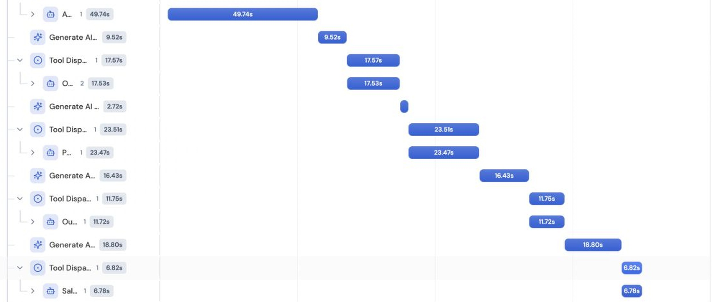

# Tests

The final build was run on four banks on 5 October 2026, between about 18:50 and 19:06 IST. Each run was a new chat in the manager's Playground. No prompt, tool, knowledge base or setting was changed between the runs.

## The test set

I picked the four banks before trusting the agent, and each one was chosen to force a different path.

| Bank | Why it is in the set | The path it should take |
| --- | --- | --- |
| Burke & Herbert | The ideal case: a midsize bank that had just merged | All five specialists, ending in a reviewed email |
| BMO | Lyzr's own site mentions it | Stop after the analyst and go to the account owner |
| Pioneer | Two banks share the name | Stop after the researcher and ask which one |
| Huntington | Strong timing, weak fit: a very large bank with its own GRC developers | All five specialists, with a stretch fit and one message only |

The inputs, exactly as typed:

```text
Burke & Herbert Bank, https://www.burkeandherbertbank.com/, as of 5 October 2026.
```

```text
BMO, https://www.bmo.com/, as of 5 October 2026.
```

```text
Pioneer. That is the only account information I have.
```

```text
Huntington National Bank, https://www.huntington.com/, as of 5 October 2026.
```

## The pass rules, written before the runs

- **Burke & Herbert:** all five specialists run in order. The message to the Sales Reviewer contains the people research in full. Packets are passed on word for word. The reviewer does not reject a detail that the people research supports.
- **BMO:** stops after the analyst and goes to the account owner. No people search and no draft.
- **Pioneer:** stops after the researcher and asks which institution.
- **Huntington:** all five specialists run. The fit comes out as stretch, with the reason. A candidate with a link, marked to confirm, or the role only when no acceptable source names anyone. One email that opens with the analyst's first hook, asks one question, says who is writing and describes Madison in its own words.

Whatever fit and rating came back were the results. The rules were about the path and the hand-offs, not about a particular number.

## Results

All four runs met their pass rules.

| Run | Outcome | Specialists called | Time | Credits |
| --- | --- | --- | --- | --- |
| [Burke & Herbert](outputs/burke-and-herbert.md) | Core fit, 3/5, medium confidence. A Chief Risk Officer candidate, to confirm. The reviewer passed the draft on its first review. | 5 | 178 s | 5.47 |
| [BMO](outputs/bmo.md) | Stretch fit, 3/5, medium confidence. Public reference, unverified. Sent to the account owner. | 2 | 97 s | 2.69 |
| [Pioneer](outputs/pioneer.md) | Unclear identity. Asked which bank, with two websites. No rating. | 1 | 19 s | 0.35 |
| [Huntington](outputs/huntington.md) | Provisional stretch fit, 3/5. Medium confidence in the timing, low in what GRC tooling the bank has. Role only: the Chief Compliance Officer's office. The reviewer passed the draft on its first review. | 5 | 190 s | 5.34 |

The step-by-step record of each run, with every message the manager sent and every packet that came back, is in [transcripts](transcripts).

## Hand-off checks

A specialist sees only what the manager pastes into its call. So for the two full runs, each place where a packet had to be passed on was compared, character for character, with what the specialist had originally returned.

| Packet | Passed to | Burke & Herbert | Huntington |
| --- | --- | --- | --- |
| Research | Analyst | Exact, 4,003 characters | Exact, 4,100 characters |
| Research | Writer | Exact, 4,003 | Exact, 4,100 |
| Analysis | Writer | Exact, 2,995 | Exact, 2,942 |
| People | Writer | Exact, 969 | Exact, 1,078 |
| Research | Reviewer | Exact, 4,003 | Exact, 4,100 |
| Analysis | Reviewer | Exact, 2,995 | Exact, 2,942 |
| People | Reviewer | Exact, 969 | Exact, 1,078 |
| Draft | Reviewer | Exact, 2,249 | Exact, 2,299 |

Also checked in both runs:

- The five specialists ran one after another, in order.
- Every call used `respond_directly=false`, `handoff=false` and `internal_call=true`.
- Each message from the manager opened with one line saying what it needed.
- No correction call and no rewrite was needed.



Studio's Activity panel is empty when a chat is reopened, so the activity was captured while each run was open. The trace above does persist. Studio cuts the names short in that view. In order, the five calls are the Account Evidence Researcher, the Opportunity Analyst, the People Researcher, the Outreach Writer and the Sales Reviewer.

## What did not pass, and what was not tested

- **The card is over its word limit.** The prompt caps the card at 200 words before the drafts. Burke & Herbert's came out at about 227 and Huntington's at about 218. No prompt was changed to fix this.
- **The exact case that failed before did not come up again.** In the previous version the reviewer rejected a detail that came from the people research. In these runs the people research reached the reviewer, and both drafts passed. But neither email used a detail from the people research, so that exact case was not exercised.
- **One run per bank.** I did not run the same input twice on the final prompts, so I cannot say how stable the ratings are. In earlier versions Huntington rated 4 in some runs and 3 in others.
- **Facts are search excerpts.** A candidate's name and title, and each cited fact, still have to be confirmed by a person who opens the link.
- **A display quirk.** In the BMO answer, Studio showed three source links as attached PDF chips and left their labels out of the sentences.

## About these copies

Names of individuals, and links to personal profiles and people directories, are withheld in the public copies in this folder. Everything else is as captured. The comparisons above were made on the original captures.

## Earlier rounds

About thirty runs are on record from 3 to 5 October, across six versions of the prompts. The run-by-run tables, with what each failure taught me, are in the [timeline](../TIMELINE.md). The changes they led to are in the [prompt change log](../prompts/CHANGELOG.md).
